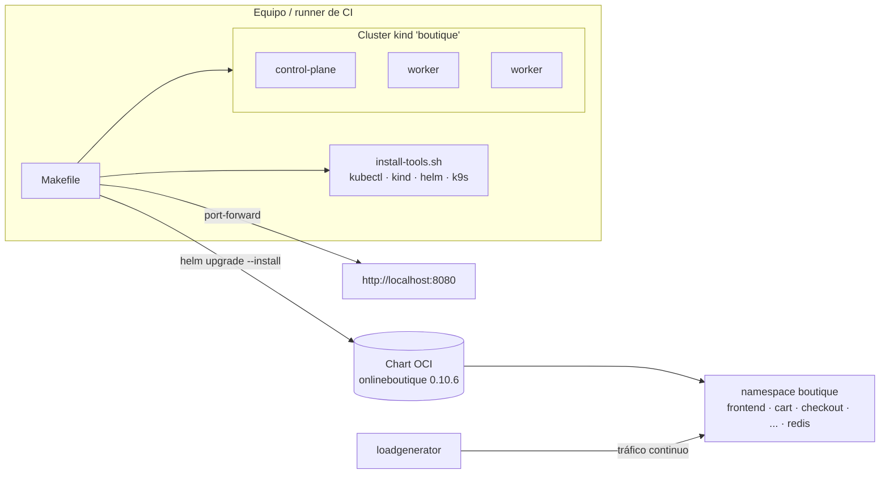

# local-k8s-lab

[](https://github.com/miguelortiz13/local-k8s-lab/actions/workflows/ci.yaml)

Entorno local **reproducible** para correr [Online Boutique](https://github.com/GoogleCloudPlatform/microservices-demo)
(11 microservicios gRPC en Go, Python, Java, C# y Node) sobre Kubernetes con
**kind**, con un solo punto de entrada: `make`.

Es el proyecto **P0** del laboratorio [devops-sre-lab](https://github.com/miguelortiz13/devops-sre-lab):
la base sobre la que se construyen IaC, CI/CD, GitOps y observabilidad.

## Qué problema resuelve

"En mi máquina funciona" empieza por no tener un entorno igual para todos.
Aquí las versiones de las herramientas están fijadas y verificadas por
checksum, el cluster está declarado en YAML y el mismo flujo que se usa en
local se ejecuta en CI en cada push.

## Arquitectura



## Cómo ejecutarlo

Prerrequisitos: Linux o WSL2, Docker, `make`, `curl` y unos 4 GB de RAM libres.

```bash
make tools    # instala kubectl, kind, helm y k9s en ~/.local/bin (versiones fijadas)
make doctor   # verifica herramientas, Docker y memoria
make up       # crea el cluster (1 control-plane + 2 workers)
make deploy   # despliega Online Boutique y espera a que esté lista
make open     # tienda en http://localhost:8080
make smoke    # prueba de humo: el frontend responde 200
make down     # destruye todo
```

`make help` lista todos los comandos.

| Variable | Por defecto | Uso |
|---|---|---|
| `CLUSTER` | `boutique` | Nombre del cluster kind |
| `NAMESPACE` | `boutique` | Namespace de la app |
| `CHART_VERSION` | `0.10.6` | Versión del chart |
| `PORT` | `8080` | Puerto local de `make open` |

## Estructura

```
Makefile                    # punto de entrada único
kind/cluster.yaml           # topología del cluster
values/onlineboutique.yaml  # overrides del chart oficial
scripts/install-tools.sh    # instalación idempotente con checksum
scripts/doctor.sh           # chequeo del entorno
scripts/smoke-test.sh       # prueba de humo HTTP
.github/workflows/ci.yaml   # lint + despliegue completo en kind en cada push
```

## CI

El workflow `ci` corre dos jobs:

1. **lint**: `shellcheck` de los scripts y render del chart con los values.
2. **e2e**: en un runner limpio ejecuta `make doctor up deploy smoke` y
   destruye el cluster. Si falla, publica pods y eventos para diagnosticar.

## Decisiones y trade-offs

- **kind en vez de minikube o k3d**: es lo que usa el propio proyecto Kubernetes
  para sus pruebas, corre igual en CI y permite varios nodos como contenedores.
- **Chart oficial vía OCI en vez de copiar manifiestos**: se sigue el release
  upstream y solo se versionan los overrides.
- **Port-forward en vez de Ingress**: mantiene P0 mínimo; la entrada con
  Gateway API llega en `platform-gitops`.
- **Binarios en `~/.local/bin`**: no requiere `sudo` y no ensucia el sistema.

## Lecciones aprendidas

- **Default roto upstream**: el chart `0.10.6` apunta a
  `google-samples/microservices-demo`, donde el tag `v0.10.6` no existe
  (todo quedaba en `ImagePullBackOff`). Las imágenes de ese release están en
  `online-boutique-ci/microservices-demo`. Se diagnosticó con los eventos del
  pod y consultando `/v2/<repo>/tags/list` del registro, y se corrigió en
  `values/onlineboutique.yaml`. Por esto el e2e en CI vale la pena: "el chart
  instala" no significa "la app arranca".
